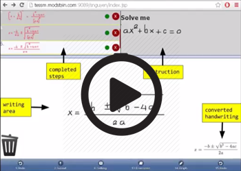

# coax
Coax is a math-aware web app to  replace pencil & paper for doing algebra exercises.  The name Coax reflects the act of "massaging" an equation into form.  Here's a 3-minute video demo.  

(see video demo.mp4 file)

Until I figure out how to use github properly, you can get the code here http://tessm.modstein.com:9089/snguyen/public/coax-0.7.tar (92MB: 22MB for code & data.  The remainder is Apache Tomcat).  See install.md for further instructions.  The project is  in Alpha stage, so some Algebra problems are not appropriate for it and do expect bugs.  This work might be appropriate for organizations with programming staff. 

Contact:  Email to numiri@yahoo.com, w/ the Subject "coax on github"  

# background
Coax grew out of <a href="https://en.wikiversity.org/wiki/KinderCalculus">KinderCalculus</a>, which teaches Calculus to K-6 students.  Surprisingly, the first hurdle for 5-7 year olds learning algebra was not the math concepts, but the mental load used to re-copy equations at every algebraic step.  A 1st-grader can understand the idea of "solve for x" as gathering all the x's together and isolating it.  Aside from proper algebraic massaging, the actual mechanics of going from one step to the next requires penmanship strategy, such as re-copying an equation while remembering to make room for the x terms to be near each other.  A mistake in executing this strategy causes a lot of re-write and frustration -- this penmanship strategy is an exercise in penmanship, NOT abstract ideas.  Coax was designed to solve this problem, and is usable by any algebra student.
<pre>
For example, let's solve for x by first gathering x terms: 
(1)      6 + 4x = -3 - 5x + 2y   (given)
(2)      6 + 4x + 5x = -3 + 2y   (desired)

With the burden of pencil and paper, a 1st grade child must exerts mental effort either by 
   (a) copy "6 + 4x __ = -3 -5x + 2y" to a new line, while remembering to leave the blank space.  
       this is a lot of writing which interrupts the train of thought.
or (b) re-use the existing line by erasing 6 + 4x and shift it left to make room.  
       this requires memorizing "6 + 4x" because it has been erased.  again, interrupting the chain of thought.

Coax allows the child to drag "6 + 4x" left to make room.  
   (1)  <--( 6 + 4x ) = -3 - 5x + 2y                  (2) 6 + 4x  ___ = -3 - 5x + 2y   
                     ^                                             ^         |
                     |                                             |         | 
        need space here, so                                        +---------+
        drag 6 + 4x to the left                          drag 5x across the " = "
</pre>
No penmanship needed.  As it turns out, abstract ideas are not the first barrier to algebra for young children -- it's penmanship!

# system layout
<pre>
The system layout is typical for a web app:         browser  <--> app server <--> database.
(lines show communications)                            |             |
                                                       |        +----+-----+     
                                                       |        |          |
                       we add 2 extensions:            handwriting     computer algebra
                                                       recognizer      system (maxima)
</pre>
The handwriting recognizer is tricky, so we rely on commercial systems.  Depending on the recognizer, it could be part of the app server, or a commercial web service elsewhere.  See too-much-info.md for a comparison of recognizers we've tried.

# The fine print
Handwriting recognizer:  
Currently, we are using Mathpix and you will need a key.  You can use my key for free on a trial basis, or get one from Mathpix (as of 2017 they charge about .005usd per web call).  Please email me or Mathpix for a key.

Licensing addendum:
You may use this software in accordance of the GPL license.  In addition, you must reserve a square area on the screen for a link or iframe devoted to math education.  The link may change from time to time and its size should be the larger of 1 cm sq or 1% of screen size.  The exact link destination is to be determined.

Status : 
The software is in an Alpha state so bugs can be expected.  Getting the product built was our primary consideration and security was secondary, so passwords are obscured by encoding, but not hashed.  This should not be a hard fix.
